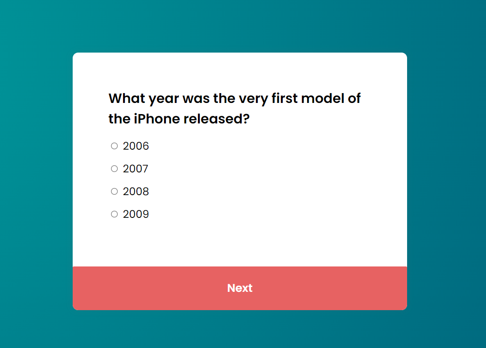
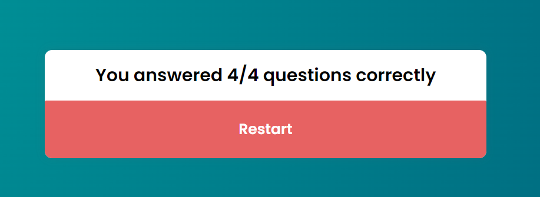

# Quiz Application

I developed this simple quiz application to allow end users select their answers from 4 options, while keeping track of their total score with correct answers.

## Description

In this repository, I created a responsive website display questions and options stored in JavaScript Array with correct answers. 

The project was implemented as below:
- Each question and options are being generated dynamically from JS Array.
- Users can click on "Next" button to submit their answers and go to the next question.
- As users hit "Next", input validation is implemented to have at least one option selected.
- On last question, "Next" button will be displayed as "Submit" button.
- Correct answers are being stored in a variable and displayed after the quiz end.

NOTE: For this project, there are only 4 questions added to the array, which are easy to update.

## Link to Site

https://ladparth.github.io/quiz-app/

This project was built with HTML, CSS, and JavaScript

## Screenshots

## Result

